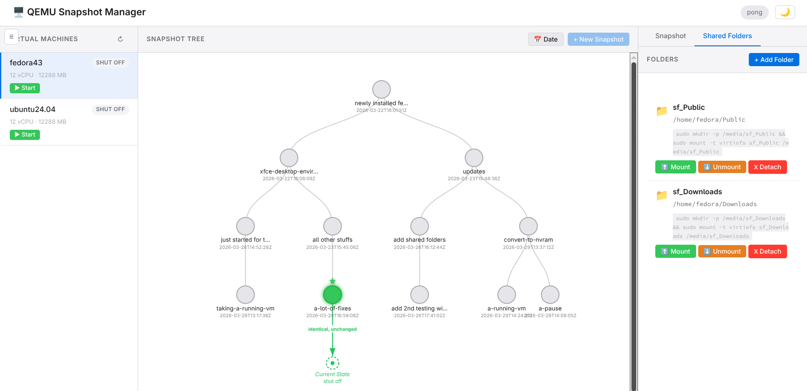

# QEMU Snapshot Web Manager (qswm)

**A lightweight web UI for managing QEMU/KVM virtual machine snapshots with tree visualization**

<!-- Badges: build status, license, etc. -->

---

## Features

- **Visual snapshot tree** — interactive D3.js tree visualization, similar to VirtualBox's snapshot view
- **Internal & external snapshot management** — create, delete, revert, and merge snapshots
- **Snapshot description editing** — modify snapshot descriptions after creation, toggle tree labels between dates and descriptions
- **Auto-merge for external snapshots** — block commit support to flatten snapshot chains
- **Orphan snapshot detection** — scans for leftover qcow2 internal snapshots after metadata-only deletes, with one-click cleanup
- **Smart revert** — detects unsaved VM state changes and offers "Save & Revert" (auto-creates backup snapshot) or "Revert Without Saving"
- **NVRAM auto-conversion** — automatically converts raw UEFI NVRAM files to qcow2 format when needed for internal snapshots
- **Shared folder management** — list (virtiofs + 9p), add, detach, mount/unmount via guest agent, real-time mount status detection, server-side directory browser for selecting source paths
- **Cross-OS auto-mount** — one-click setup detects guest OS and installs the appropriate service: systemd timer (Linux), OpenRC init script (Alpine), scheduled task (Windows), rc.d service (FreeBSD), or launchd plist (macOS)
- **Guest agent integration** — mount and unmount shared folders inside VMs through QEMU guest agent, with OS-specific installation help when the agent is missing
- **VM lifecycle controls** — start, stop, pause, resume, and force-stop virtual machines
- **Dirty state tracking** — warns when VM state has diverged from the last snapshot before reverting
- **Real-time status updates** — keeps the UI in sync with VM state changes
- **Cross-platform guest support** — detects guest OS automatically; Linux host (libvirt/KVM) with experimental macOS host support (libvirt/HVF)
- **Zero JS toolchain** — no npm, no node, no build step — just C and a browser
- **Tiny footprint** — single ~100KB binary, 14KB of HTMX + D3 loaded from CDN

## Screenshots



## Installation

### One-line install

```bash
curl -fsSL https://raw.githubusercontent.com/ctrngk/qemu-snapshot-web-manager/main/install.sh | sudo bash
```

Automatically detects your OS and architecture, downloads the correct package from [GitHub Releases](https://github.com/ctrngk/qemu-snapshot-web-manager/releases), and installs it.

### Package install

Download the latest package for your distro from [GitHub Releases](https://github.com/ctrngk/qemu-snapshot-web-manager/releases):

```bash
# Fedora/RHEL
sudo dnf install ./qswm-*.rpm

# Ubuntu/Debian
sudo dpkg -i ./qswm_*.deb

# Alpine
sudo apk add --allow-untrusted ./qswm-*.apk

# Generic Linux (tarball)
tar xzf qswm-*-linux-*.tar.gz
cd qswm-*/
sudo ./install.sh
```

Then enable socket activation:

```bash
sudo systemctl enable --now qswm.socket qswm-idle.timer
```

### Build from source (Fedora/RHEL)

```bash
sudo dnf install gcc make pkg-config libmicrohttpd-devel libvirt-devel jansson-devel systemd-devel
git clone https://github.com/ctrngk/qemu-snapshot-web-manager.git
cd qemu-snapshot-web-manager
make
```

### System-wide install

```bash
sudo make install
sudo systemctl enable --now qswm.socket qswm-idle.timer
```

The `make install` target installs:
- `qswm` binary → `/usr/local/bin/qswm`
- Static assets → `/usr/local/share/qswm/static/`
- Systemd units → `/etc/systemd/system/qswm.{socket,service}`, idle timer + check
- Idle check script → `/usr/local/libexec/qswm/idle-check.sh`
- Config directory → `/etc/qswm/conf.d/`

**Socket activation:** The service starts automatically on the first browser visit to port 9091, and stops after 10 minutes of inactivity. No resources are used when idle.

### Uninstall

```bash
sudo make uninstall
```

This disables all systemd units, removes the binary, static files, and systemd unit files. Your config files in `/etc/qswm/conf.d/` are preserved.

### Prerequisites for shared folder mounting

To mount/unmount shared folders inside VMs, install the QEMU guest agent in the guest OS:

```bash
# Fedora/RHEL
sudo dnf install qemu-guest-agent
sudo systemctl enable --now qemu-guest-agent

# Debian/Ubuntu
sudo apt install qemu-guest-agent
sudo systemctl enable --now qemu-guest-agent
```

### macOS (experimental)

```bash
brew install libmicrohttpd libvirt jansson pkg-config
make
```

To launch automatically on macOS, create a launchd plist:

```bash
sudo tee /Library/LaunchDaemons/com.qswm.plist <<EOF
<?xml version="1.0" encoding="UTF-8"?>
<!DOCTYPE plist PUBLIC "-//Apple//DTD PLIST 1.0//EN" "http://www.apple.com/DTDs/PropertyList-1.0.dtd">
<plist version="1.0">
<dict>
    <key>Label</key>
    <string>com.qswm</string>
    <key>ProgramArguments</key>
    <array>
        <string>/usr/local/bin/qswm</string>
        <string>--port</string>
        <string>9091</string>
        <string>--static-dir</string>
        <string>/usr/local/share/qswm/static</string>
    </array>
    <key>RunAtLoad</key>
    <true/>
    <key>KeepAlive</key>
    <false/>
    <key>Sockets</key>
    <dict>
        <key>Listeners</key>
        <dict>
            <key>SockServiceName</key>
            <string>9091</string>
            <key>SockType</key>
            <string>stream</string>
        </dict>
    </dict>
</dict>
</plist>
EOF
sudo launchctl load /Library/LaunchDaemons/com.qswm.plist
```

> **Note:** macOS socket activation uses launchd instead of systemd. The idle auto-shutdown timer is Linux-only; on macOS the service runs until manually stopped or the system reboots.

## Usage

### Command-line options

| Flag | Default | Description |
|------|---------|-------------|
| `--port`, `-p` | `9091` | HTTP listen port |
| `--static-dir`, `-s` | `./static` | Path to static assets directory |
| `--uri`, `-u` | `qemu:///system` | Libvirt connection URI |
| `--help`, `-h` | — | Show usage information |

### Web UI overview

The interface uses a three-panel layout:

1. **Left panel** — VM list with status indicators and lifecycle controls
2. **Center panel** — interactive snapshot tree rendered with D3.js
3. **Right panel** — snapshot details, creation form, and action buttons

### Snapshot operations

- **Create** — choose between internal (single-file, requires VM pause) or external (copy-on-write overlay, live-capable) snapshots
- **Revert** — restore a VM to a previous snapshot state
- **Delete** — remove a snapshot from the tree
- **Merge** — flatten an external snapshot back into its backing file via block commit

### Internal vs external snapshots

**Internal snapshots** store both disk and memory state inside the qcow2 image file itself. They are simple and self-contained but require the VM to be paused during creation.

**External snapshots** create a new overlay qcow2 file that records changes relative to the original image. They support live creation without pausing the VM, but create a chain of files that may need to be merged (block commit) to reclaim space and simplify the tree.

## Configuration

qswm uses sensible defaults. To override, create drop-in files in `/etc/qswm/conf.d/`:

```bash
sudo mkdir -p /etc/qswm/conf.d
sudo tee /etc/qswm/conf.d/10-custom.conf <<EOF
[general]
port = 8080
idle_timeout = 300
uri = qemu:///system
static_dir = /usr/local/share/qswm/static
EOF
```

Files are read in alphabetical order; later files override earlier ones. CLI arguments override config files.

| Key | Default | Description |
|-----|---------|-------------|
| `port` | `9091` | HTTP listen port |
| `idle_timeout` | `600` | Seconds idle before auto-shutdown (0 = disabled) |
| `uri` | `qemu:///system` | Libvirt connection URI |
| `static_dir` | `/usr/local/share/qswm/static` | Path to static assets |

## Architecture

### Socket activation flow

```
Boot → qswm.socket (listening, zero resources)
       ↓ first connection
       systemd starts qswm.service
       ↓ idle for 10 min
       qswm-idle.timer stops qswm.service
       qswm.socket keeps listening → cycle repeats
```

### Components

```
┌──────────────┐       ┌──────────────────┐       ┌──────────┐
│   Browser    │──────▶│  C backend       │──────▶│ libvirt  │
│  HTMX + D3  │◀──────│  (libmicrohttpd) │◀──────│  daemon  │
└──────────────┘ HTML  └──────────────────┘       └──────────┘
                 frag.    REST API + static
```

- **C backend** — [libmicrohttpd](https://www.gnu.org/software/libmicrohttpd/) serves both the REST API and static files
- **HTMX** — returns HTML fragments for partial-page UI updates (no SPA framework needed)
- **D3.js** — renders an interactive snapshot tree from a JSON endpoint
- **Backend abstraction** — a hypervisor abstraction layer (vtable pattern) allows supporting multiple backends (libvirt, UTM stub)
- **Codebase size** — ~4000 lines of C, ~300 lines of JavaScript

## API Reference

| Method | Endpoint | Description |
|--------|----------|-------------|
| `GET` | `/api/ping` | Health check |
| `GET` | `/api/idle-check` | Seconds since last request (for idle auto-shutdown) |
| `GET` | `/api/vms` | List VMs (HTML) |
| `POST` | `/api/vms/{name}/start` | Start VM |
| `POST` | `/api/vms/{name}/stop` | Stop VM |
| `POST` | `/api/vms/{name}/pause` | Pause VM |
| `POST` | `/api/vms/{name}/resume` | Resume paused VM |
| `POST` | `/api/vms/{name}/force-stop` | Force-stop VM (destroy) |
| `POST` | `/api/vms/{name}/convert-nvram` | Convert UEFI NVRAM to qcow2 format |
| `GET` | `/api/vms/{name}/snapshots` | Snapshot tree (JSON) |
| `GET` | `/api/vms/{name}/snapshots/{snap}` | Snapshot detail (HTML) |
| `GET` | `/api/vms/{name}/snapshots/{snap}/edit` | Edit snapshot form (HTML) |
| `PUT` | `/api/vms/{name}/snapshots/{snap}` | Update snapshot description |
| `GET` | `/api/vms/{name}/snapshots/{snap}/revert-confirm` | Revert confirmation dialog (HTML) |
| `GET` | `/api/vms/{name}/snapshots/form` | Create snapshot form (HTML) |
| `POST` | `/api/vms/{name}/snapshots` | Create snapshot |
| `DELETE` | `/api/vms/{name}/snapshots/{snap}` | Delete snapshot |
| `POST` | `/api/vms/{name}/snapshots/{snap}/revert` | Revert to snapshot |
| `POST` | `/api/vms/{name}/snapshots/{snap}/merge` | Merge external snapshot |
| `GET` | `/api/vms/{name}/orphan-check` | Scan for orphan qcow2 snapshots (HTML) |
| `POST` | `/api/vms/{name}/orphan-cleanup` | Remove orphan qcow2 snapshots |
| `GET` | `/api/vms/{name}/shared-folders` | List shared folders (HTML) |
| `GET` | `/api/vms/{name}/shared-folders/form` | Add shared folder form (HTML) |
| `POST` | `/api/vms/{name}/shared-folders` | Add shared folder |
| `DELETE` | `/api/vms/{name}/shared-folders/{tag}` | Detach shared folder |
| `POST` | `/api/vms/{name}/shared-folders/{tag}/mount` | Mount inside guest VM |
| `POST` | `/api/vms/{name}/shared-folders/{tag}/unmount` | Unmount inside guest VM |
| `POST` | `/api/vms/{name}/shared-folders/automount` | Install auto-mount service in guest VM |
| `GET` | `/api/browse?path=...` | Server-side directory browser (HTML) |

## Known Limitations

- **UTM backend is a stub** — `utmctl` has no snapshot management commands; macOS support is experimental
- **No authentication** — designed for localhost use; do not expose to untrusted networks
- **No WebSocket** — UI updates are polling-based, not push-based
- **Single-disk assumption** — external snapshot merge (block commit) assumes VMs have a single disk
- **Requires root** — `qemu:///system` connections require root privileges
- **Guest agent required** — shared folder mount/unmount and auto-mount require QEMU guest agent installed in the VM; the UI shows OS-specific install instructions when the agent is missing

## Development

### Quick start

```bash
# Install dependencies (Fedora)
sudo dnf install gcc make pkg-config libmicrohttpd-devel libvirt-devel jansson-devel systemd-devel

# Build and run locally (no install needed)
make
sudo ./build/qswm --port 9091 --static-dir ./static

# Open browser
xdg-open http://localhost:9091
```

### Build targets

```bash
make            # release build (with optimizations)
make debug      # debug build with symbols and sanitizers
make test       # run unit tests
make clean      # remove build artifacts
```

### Project structure

```
qemu-snapshot-web-manager/
├── src/
│   ├── main.c            # entry point, argument parsing, signal handlers
│   ├── server.c/.h       # HTTP server (libmicrohttpd), static file serving, MIME detection
│   ├── routes.c/.h       # API route dispatcher, request/response helpers
│   ├── vm_backend.c/.h   # hypervisor abstraction layer (vtable pattern)
│   ├── libvirt_backend.c/.h  # libvirt implementation of vm_backend_t
│   ├── utm_backend.c/.h  # UTM implementation (macOS only, Linux stub)
│   ├── snapshot.c/.h     # snapshot tree data structure + JSON serialization
│   ├── html_render.c/.h  # HTML fragment generators for HTMX responses
│   ├── config.c/.h       # drop-in config parser (/etc/qswm/conf.d/)
│   └── util.c/.h         # logging, string helpers, URL decoding
├── static/
│   ├── index.html        # app shell (HTMX attributes, 3-column layout)
│   ├── styles.css        # CSS (grid layout, custom properties, responsive)
│   └── tree.js           # D3.js snapshot tree visualization
├── docs/
│   ├── getting-started.md
│   ├── user-guide.md
│   └── developer-guide.md
├── scripts/              # helper scripts (setup, build, dev, test, install, uninstall, deps, idle-check)
├── systemd/              # systemd units (socket, service, idle timer)
├── tests/
│   ├── test_snapshot_tree.c   # 7 snapshot tree tests
│   ├── test_html_render.c     # 6 HTML renderer tests
│   └── test_config.c          # 5 config parser tests
├── Makefile
└── README.md
```

## Documentation

- [Getting Started](docs/getting-started.md) — installation, first run, basic usage
- [User Guide](docs/user-guide.md) — snapshots, shared folders, VM management
- [Developer Guide](docs/developer-guide.md) — architecture, building, testing, contributing

## License

MIT License — see [LICENSE](LICENSE) for details.

## Credits

Built with these excellent libraries:

- [libmicrohttpd](https://www.gnu.org/software/libmicrohttpd/) — embedded HTTP server
- [libvirt](https://libvirt.org/) — virtualization API
- [jansson](https://github.com/akheron/jansson) — JSON library for C
- [libsystemd](https://www.freedesktop.org/wiki/Software/systemd/) — socket activation and service integration
- [HTMX](https://htmx.org/) — HTML-over-the-wire interactions
- [D3.js](https://d3js.org/) — data-driven DOM visualization
